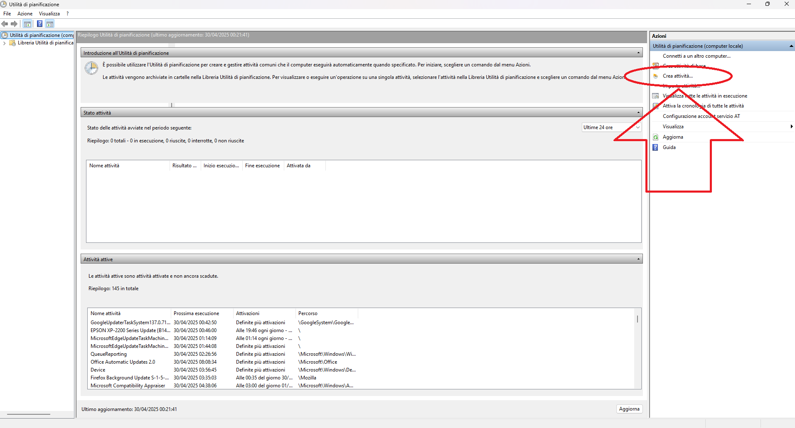
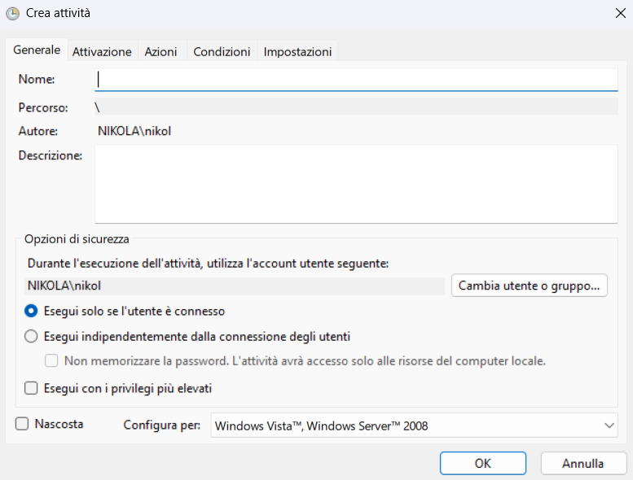
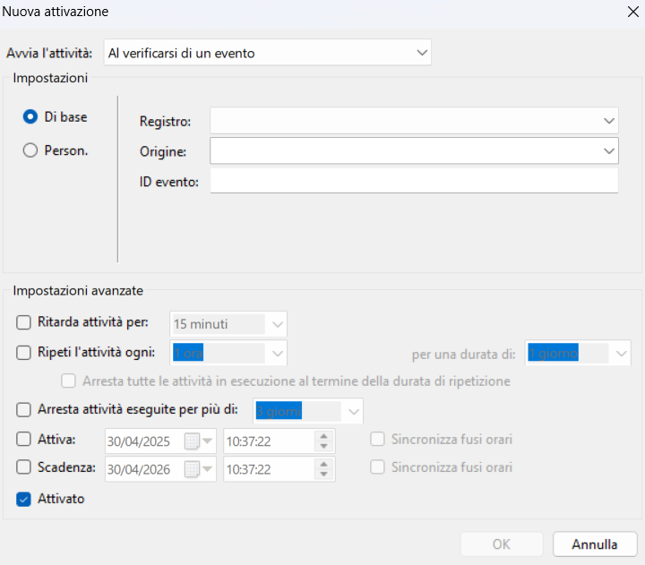

# **Creazione di eventi nell'utilità di pianificazione**

## ***1  Cos'è l'utilità di pianificazione***
L'utilità di pianificazione è una componente di Windows che permette all'utente di far svolgere determinate azioni quali: backup, eliminazione dei file, manutenzione, ecc...
Queste azioni verranno scatenate da un evento a scelta dall'utente.

---
## ***2  Come pianificare un evento***
### ***2.1  l'utilità di pianificazione***
Per aprire l'utilità di pianificazione ci sono due strade principali:
> [!NOTE] 
>
>Had some problems with the previous commit and this area of the work went lost. Will be fixed as soon as possible
### ***2.2  Come iniziare la creazione di un evento***
Dopo aver aperto l'utilità di pianificazione dobbiamo guardare la colonna sulla destra nello schermo e premere sulla scritta `Crea Evento`

> [!TIP]
>In caso di difficoltà nel trovare la scritta consultare la foto sotto

### ***2.3  Prima Pagina nella creazione***
Una volta premuta la scritta `Crea Evento` apparirà questa finestra sul vostro schermo:

Mi sembra oppurtuno a questo punto guidarvi nella navigazione in questa finestra:

* **Barra di navigazione a schede (Generale,Attivazione,Azioni,Condizioni,Impostazioni)**: permette all'utente di navigare le varie schede che hanno funzionalità per creare eventi specifici. Entrerò nei dettagli in un prossimo sotto capitolo

* **Nome**: è il nome col quale potrai identificare l'evento che hai creato.

* **Percorso**: è la sottocartella della cartella presente nella colonna a sinistra della prima immagine nel quale verrà salvato il tuo evento una volta creato.

* **Autore**: indica l'utente che ha creato l'evento nel mio caso come si può notare dalla seconda immagine sarei io.

* **Descrizione**: permette di dare una descrizione all'evento rendendolo dunque più comprensibile a chiunque si occuperà di modificarlo. Questa opzione è sopratutto utile in ambito aziendale piuttosto che in ambito privato.

* **Cambia utente o gruppo**: questo tasto ti permette di scegliere chi sarà a svolgere l'azione una volta che l'evento verrà scatenato.

* **Gestione degli utenti**: 
    * **Primo radio button**: Se selezionato l'evento verrà attivato solo se è l'utente è collegato.
    * **Il secondo radio button**: Se si seleziona l'evento si attiverà sia se l'utente è collegato sia che non sia collegato. Questa selezione porta anche all'abilitazione di una checkbox che permette di scegliere se far ricordare o meno la password dell'utente. Questa opzione è consigliabile non attivarla se si deve lavorare sul sistema e non su un utente specifico in quanto potrebbe risultare in un falla se si subisce un attacco informatico.

* **Esegui con i privelegi più elevati**: Permette di eseguire l'evento con amministratore.

* **Nascosta**: Nasconde l'evento

### ***2.4  Gestione dell'attivazione dell'evento***
Una volta configurata la scheda generale va configurata quella che gestisce l'attivazione dell'evento. Premendo su nuovo si paleserà la finestra della foto sottostante.

* **Combo Box**: La comboBox ha lo scopo di far scegliere all'utente come si avvierà l'attività. Non andrò ad approfondire tutti gli eventi ma tratterò solamente la sezione: `al verificarsi di un evento`
* **Impostazioni groupBox**: Questa porzione ha lo scopo di farti personalizzare completamente l'evento tramite codici specifici. Per compilare i 3 campi sottostanti si deve cercare l'evento nel `visualizzatore eventi` e trovare tutti i dettagli scritti lì.

Il resto sono impostazioni sul tempo ma mi sembrano abbastanza esplicative quindi le salterò.

### ***2.4  Seconda Pagina nella creazione***

>[!IMPORTANT]
> Sto Lavorando ancora alla realizzazione di questi appunti